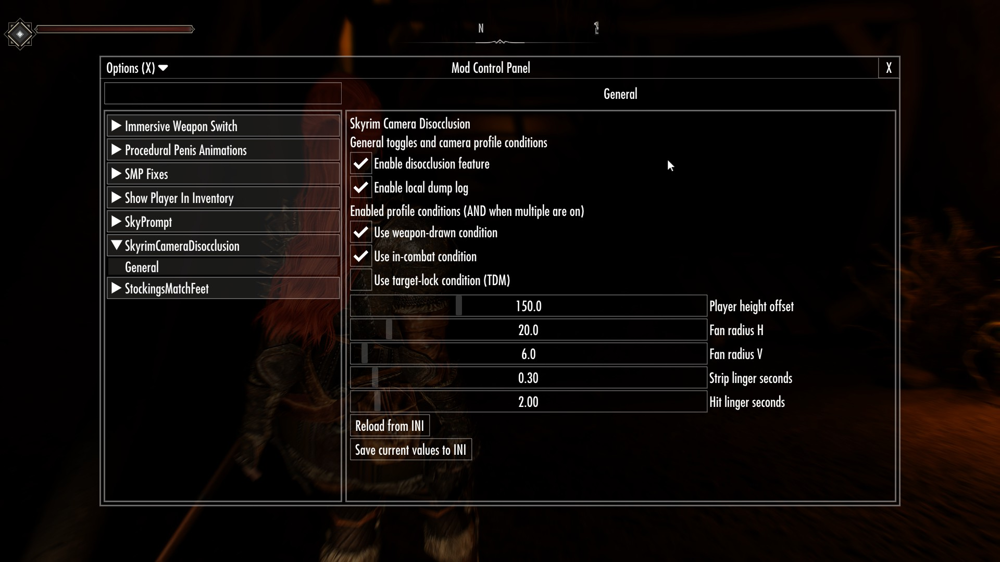
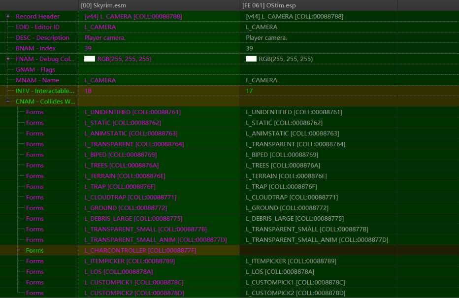
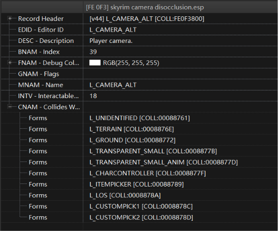

# Upstream Patch Review Guide

This document explains the newly added patch features for easy upstream review and cherry-pick.

## What This Patch Adds

1. SKSE menu integration (SMF) for runtime configuration.
2. A master toggle that controls which camera collision profile is selected.
3. Optional condition-based profile switching:
   - weapon drawn
   - in combat
   - target lock (TDM graph variable)
4. AND semantics when multiple conditions are enabled.
5. Thread-safety guard:
   - non-update-thread requests are deferred
   - profile mutation is committed on player update thread
6. Debounce/hysteresis (150ms default) to reduce rapid profile oscillation near state boundaries.

## Design Model

The feature uses two camera collision profiles:

- Enabled profile: mod-authored BGSCollisionLayer spec
- Disabled profile: vanilla fallback BGSCollisionLayer spec

Typical setup in this branch:

- Disabled profile keeps vanilla behavior unchanged:
  - `Skyrim.esm|088788`

- Enabled profile is a new BGSCollisionLayer added by the mod plugin:
  - e.g. `skyrim camera disocclusion.esp|800`

In other words, vanilla profile is preserved, and the mod contributes a separate collision profile for runtime switching.

## Runtime Selection Rules

1. Master toggle OFF:
   - always use Disabled profile.
2. Master toggle ON with no condition toggles enabled:
   - use Enabled profile (legacy behavior).
3. Master toggle ON with one or more condition toggles enabled:
   - use Enabled profile only when all enabled conditions are true.
   - otherwise use Disabled profile.

## Why Layer Index + Mask Both Matter

Enabled and Disabled specs can resolve to the same `collisionIdx` while having different CNAM collision masks.

Because of that, runtime switching applies both:

- collision layer index
- `bhkCollisionFilter.layerBitfields[idx]` mask (CNAM-equivalent)

This is required for correct behavior when `layerIdx` is identical but masks differ.

## Collision Refresh After Profile Switch

Yes, this patch explicitly refreshes collision-related runtime state whenever profile switching is committed.

After a profile switch (Enabled <-> Disabled), runtime apply updates:

- camera root collision layer
- camera rigid body collidable filter layer
- `bhkCollisionFilter.layerBitfields[idx]` mask (CNAM-equivalent global filter table)

This means profile switching is not only a logical state change; it also performs concrete collision refresh so the new profile takes effect immediately.

Apply is triggered from these paths:

- startup/data-loaded synchronization
- explicit menu toggle operations (master/condition toggles)
- update-driven condition transitions (including deferred thread-safe commit path)

For review, see `ApplyCameraCollisionLayer(...)` in `src/Hook.cpp` and related call sites (`EvaluateAndApplyProfile`, deferred drain, and toggle/data-loaded entry points).

## Thread Safety Strategy

Camera/Havok writes are considered update-thread-affine.

- If profile selection is requested from non-update thread (startup/menu/message path), desired target profile is stored atomically and deferred.
- Deferred request is drained and applied in `HookPlayerCharacter::Update`.

This avoids cross-thread mutation of camera/collision state.

## Debounce Strategy

To reduce rapid flip-flop around condition boundaries, a 150ms debounce window is applied to non-forced profile transitions.

- Forced operations (explicit menu actions/startup sync) bypass debounce for immediate deterministic effect.
- Non-forced update-driven transitions must remain stable for the debounce window before commit.

Trade-off:

- Better stability and fewer repetitive applies
- Up to 150ms intentional delay for automatic profile flips

## Logging and Diagnostics

The patch adds explicit logs for:

- condition state snapshots
- layer spec resolution and mask details
- deferred apply events
- debounce start/commit events
- final layer apply result (root/rigidBody/filter)

This is intended to simplify upstream verification and field bug reports.

## File Map

Primary implementation files:

- `src/main.cpp` (SMF menu and user actions)
- `src/Settings.h`
- `src/Settings.cpp` (INI persistence and toggles)
- `src/Hook.cpp` (condition evaluation, thread-safe apply, debounce, profile switch)
- `dist/SKSE/Plugins/skyrimcameradisocclusion.ini` (new condition keys)

## Suggested Review Checklist

1. Verify master OFF always selects Disabled profile.
2. Verify AND semantics with two or three condition toggles enabled.
3. Verify identical layerIdx + different mask case by checking runtime filter updates.
4. Verify no crash during startup/data-loaded path with TDM installed.
5. Verify debounce reduces rapid toggling while preserving expected behavior.
